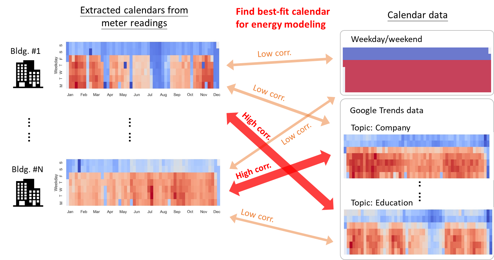

# Using Google Trends as a proxy for occupant behavior to predict building energy consumption

## Overview

This project explores the use of Google Trends data as a proxy for occupant behavior to improve building energy consumption predictions. By leveraging search volume trends for various topics, we aim to infer occupant behavior patterns and incorporate this information into energy prediction models.

## Objectives

In building performance simulation and prediction research, quantifying occupant behaviors across different building types, countries, and regions is a challenging task. This project investigates whether Google Trends data can provide valuable insights into occupant behavior through time-series trends of search volumes for specific keywords.

Key research questions:
1. How can we evaluate whether the search volume of topics matches the energy use behaviors of buildings?
2. How much can the accuracy of energy models be improved by incorporating calendars derived from Google Trends?
3. Which topics are most effective in improving model prediction performance?
4. Can this method be scaled across multiple sites from diverse locations?

## Dataset

### Google Trends data
- [Daily trend data](data/google-trends-data_2016-2018.csv)
- [Download-Google-trends-data.ipynb](notebooks/Download-Google-trends-data.ipynb): Notebook for downloading and processing Google Trends data

### Building Data Genome Project 2 (BDG2)
- [BDG2 Dataset](https://www.kaggle.com/claytonmiller/buildingdatagenomeproject2): Contains hourly meter readings and metadata for 3,053 energy meters over two years

### ASHRAE - Great Energy Predictor III (GEPIII)
- [GEPIII Dataset](https://www.kaggle.com/c/ashrae-energy-prediction/data): Competition dataset used for benchmarking energy prediction models

## Notebooks

### Modeling
- [Baseline model](notebooks/kfold-lightgbm-without-leak-1-062.ipynb): LightGBM-based model without Google Trends data
- [Proposed method with Google Trends](notebooks/proposed-method-with-google-trends.ipynb): Enhanced model incorporating Google Trends data

### Analysis
- [Correlation-between-energy-and-topics.ipynb](notebooks/Correlation-between-energy-and-topics.ipynb): Derive occupant behavior from electricity meter time series using PCA and calculate correlations with Google Trends topics
- [Result.ipynb](notebooks/Result.ipynb): Visualization and analysis of results

## License

This project is licensed under the terms of the MIT license.

## Citation

If you use this work in your research, please cite our paper: https://doi.org/10.1016/j.apenergy.2021.118343
